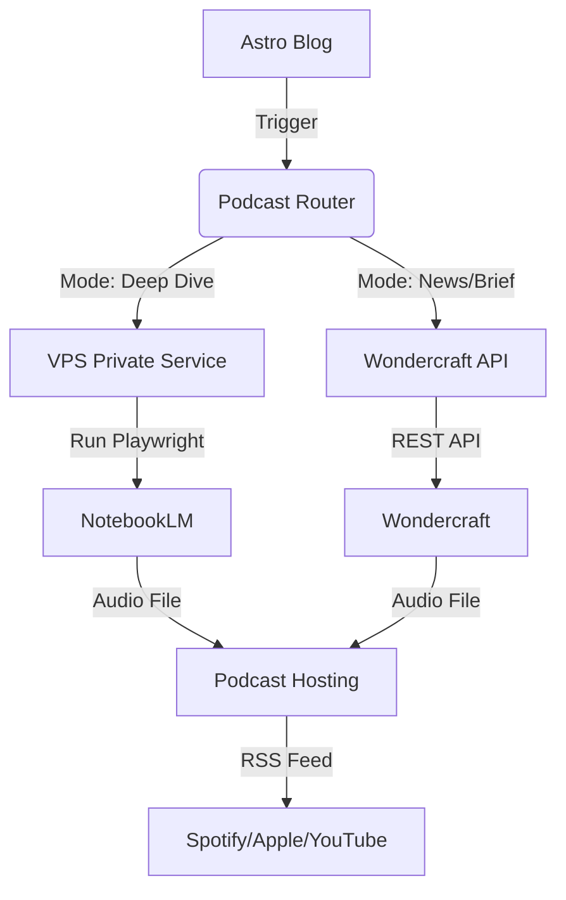

# 博客转播客自动化方案

## 📋 项目概述

**目标**: 将现有Astro博客内容自动转换为专业品质播客，实现内容的多平台分发和受众覆盖面扩展。

**核心策略**: API集成方案，利用Wondercraft AI、ElevenLabs等专业服务，实现实时自动转换。

**预期效果**: 内容复用率提升300%，触达播客听众群体，发布效率显著提升。

---

## 🎯 需求分析

### 用户选择的功能特性
- **实现方式**: 混合架构 (NotebookLM Private Service + Wondercraft API)
- **发布频率**: 实时自动（博客发布后立即转换）
- **音频质量**: 
  - **深度内容**: NotebookLM "Audio Overview" (双人对话，强理解)
  - **快讯内容**: Wondercraft/ElevenLabs (专业播音，高可控)

### 技术要求
- 与现有Astro博客系统无缝集成
- 保持博客原有功能和性能
- 支持批量处理和错误恢复
- 提供转换状态监控

---

## 🏗️ 技术架构

### 核心组件
### 核心组件


### 服务分层
1.  **控制层 (Astro Blog)**:
    *   负责策略路由 (根据文章 Tag 决定使用哪个引擎)
    *   负责状态管理 (Processing -> Completed)
    *   负责最终上传发布

2.  **计算层 A (VPS - 4C4G)**:
    *   部署 **NotebookLM-Bridge** (Python/FastAPI)
    *   运行 Playwright 模拟用户操作生成 Audio Overview
    *   优势: 免费、效果极佳、Deep Dive 风格

3.  **计算层 B (SaaS API)**:
    *   Wondercraft/ElevenLabs
    *   优势: 稳定、无需维护、适合短内容

---

## 📊 实施方案

### Phase 1: API集成与基础架构 (Week 1)

#### 1.1 Wondercraft AI API集成
```javascript
// scripts/podcast-generator.mjs
const WONDERCRAFT_API = 'https://api.wondercraft.ai/v1/generate';

async function generatePodcast(blogContent) {
  const response = await fetch(WONDERCRAFT_API, {
    method: 'POST',
    headers: {
      'Authorization': `Bearer ${process.env.WONDERCRAFT_API_KEY}`,
      'Content-Type': 'application/json'
    },
    body: JSON.stringify({
      input_text: blogContent,
      voice_style: 'professional_conversational',
      output_format: 'podcast_episode',
      include_intro: true,
      include_outro: true,
      background_music: 'subtle_tech'
    })
  });
  
  return response.json();
}
```

#### 1.2 内容提取与优化
```javascript
// scripts/content-processor.mjs
export async function processBlogContent(blogPost) {
  // 提取关键内容
  const content = extractMainContent(blogPost.body);
  const summary = generateSummary(blogPost.description);
  
  // 优化为播客格式
  const podcastScript = await optimizeForAudio(content, {
    addConversationalElements: true,
    includeTimestamps: true,
    optimizeForListening: true
  });
  
  return {
    title: blogPost.data.title,
    description: summary,
    script: podcastScript,
    duration: estimateDuration(podcastScript),
    tags: blogPost.data.tags
  };
}
```

// src/pages/api/webhook/podcast.js
// 伪代码：策略路由逻辑
const ENGINE_CONFIG = {
  'deep-dive': 'notebooklm-vps',
  'news': 'wondercraft',
  'default': 'notebooklm-vps' // 默认优先使用效果更好的 NotebookLM
};

export async function POST({ request }) {
  const { postId, tags } = await request.json();
  
  // 1. 决定引擎
  const engineVar = tags.includes('news') ? 'news' : 'default';
  const engine = ENGINE_CONFIG[engineVar];
  
  // 2. 触发转换
  if (engine === 'notebooklm-vps') {
    await callVPSService(postId); // 调用 VPS 上的 Python 服务
  } else {
    await callWondercraftAPI(postId); // 调用现有 SaaS API
  }
}
```

### Phase 2: VPS NotebookLM 服务搭建 (New)

#### 2.1 Python Bridge Service (FastAPI)
在 VPS 上部署，作为连接 NotebookLM 的桥梁。

```python
# main.py (部署在 VPS)
from fastapi import FastAPI, BackgroundTasks
from notebooklm_automation import generate_audio_overview

app = FastAPI()

@app.post("/generate")
async def generate_podcast(url: str, webhook_callback: str, background_tasks: BackgroundTasks):
    # 异步处理，避免 HTTP 超时
    background_tasks.add_task(process_notebooklm, url, webhook_callback)
    return {"status": "accepted", "message": "Task queued"}

async def process_notebooklm(url: str, callback_url: str):
    try:
        # 1. 使用 Playwright 自动化 NotebookLM
        # 2. 上传 URL -> 生成 Audio -> 下载 MP3
        audio_url = await generate_audio_overview(url)
        
        # 3. 回调 Astro Blog 通知完成
        requests.post(callback_url, json={
            "status": "completed", 
            "audioUrl": audio_url
        })
    except Exception as e:
        requests.post(callback_url, json={"status": "failed", "error": str(e)})
```

#### 2.2 部署架构 (Docker compose)
```yaml
version: '3'
services:
  notebooklm-bridge:
    build: .
    ports:
      - "8000:8000"
    environment:
      - GOOGLE_LOGIN_COOKIE=... # 需要定期更新 Cookie
    restart: always
```

### Phase 3: 音频质量与发布 (Merged)

#### 3.1 质量控制 (适用于所有引擎)
保留现有的质量控制逻辑，对 NotebookLM 生成的音频也进行长度和格式检查。
*(代码复用现有 scripts/quality-control.mjs)*

### Phase 4: 播客托管与发布

#### 3.1 Transistor.fm集成
```javascript
// scripts/podcast-host.mjs
class PodcastHostManager {
  async uploadEpisode(audioData, metadata) {
    const formData = new FormData();
    formData.append('audio_file', audioData.audioBuffer);
    formData.append('title', metadata.title);
    formData.append('description', metadata.description);
    formData.append('tags', JSON.stringify(metadata.tags));
    
    const response = await fetch('https://api.transistor.fm/v1/episodes', {
      method: 'POST',
      headers: { 'Authorization': `Bearer ${this.apiKey}` },
      body: formData
    });
    
    return response.json();
  }
  
  async publishEpisode(episodeId) {
    // 自动发布到Apple Podcasts, Spotify等平台
    return await this.publishToPlatforms(episodeId);
  }
}
```

#### 3.2 社交媒体同步
```javascript
// scripts/social-sync.mjs
export async function announcePodcastEpisode(episodeData) {
  const tweetContent = `🎙️ 新播客上线！${episodeData.title}\n\n${episodeData.description}\n\n收听链接: ${episodeData.url}\n\n#播客 #AI #技术分享`;
  
  await fetch('https://api.twitter.com/2/tweets', {
    method: 'POST',
    headers: {
      'Authorization': `Bearer ${process.env.TWITTER_API_KEY}`,
      'Content-Type': 'application/json'
    },
    body: JSON.stringify({ text: tweetContent })
  });
}
```

### Phase 5: 监控与优化

#### 4.1 转换状态监控
```astro
---
// src/components/PodcastStatus.astro
const { blogPostId } = Astro.props;
const podcastStatus = await getPodcastConversionStatus(blogPostId);
---

<div class="podcast-status">
  {podcastStatus.status === 'processing' && (
    <div class="status-processing">
      <span>🎙️ 播客转换中...</span>
      <div class="progress-bar" style={`width: ${podcastStatus.progress}%`}></div>
    </div>
  )}
  
  {podcastStatus.status === 'completed' && (
    <div class="status-completed">
      <span>✅ 播客已发布</span>
      <a href={podcastStatus.episodeUrl} target="_blank">收听</a>
    </div>
  )}
</div>
```

#### 4.2 性能分析仪表板
```javascript
// src/pages/admin/podcast-analytics.astro
export async function GET() {
  const analytics = {
    totalConversions: await getConversionCount(),
    successRate: await getSuccessRate(),
    averageProcessingTime: await getAverageProcessingTime(),
    popularEpisodes: await getPopularEpisodes()
  };
  
  return Response.json(analytics);
}
```

---

## 🔧 配置与部署

### 环境变量配置
```bash
# .env
# API Keys
WONDERCRAFT_API_KEY=your_wondercraft_api_key
ELEVENLABS_API_KEY=your_elevenlabs_api_key
TRANSISTOR_API_KEY=your_transistor_api_key
TWITTER_API_KEY=your_twitter_api_key

# 质量控制
PODCAST_QUALITY_THRESHOLD=0.8
MAX_RETRY_ATTEMPTS=3

# 功能开关
AUTO_PUBLISH_ENABLED=true
SOCIAL_MEDIA_SYNC_ENABLED=true
QUALITY_CHECK_ENABLED=true
```

### Astro配置更新
```javascript
// astro.config.mjs
export default defineConfig({
  integrations: [
    // 现有集成...
  ],
  server: {
    hooks: {
      buildStart: async () => {
        // 初始化播客转换服务
        await initializePodcastService();
      }
    }
  },
  vite: {
    plugins: [
      // 播客处理插件
      podcastPlugin({
        apiEndpoint: '/api/webhook/podcast',
        autoConvert: true
      })
    ]
  }
});
```

---

## 📈 监控指标

### 转换性能指标
- **转换成功率**: 目标 >95%
- **平均处理时间**: 目标 <5分钟
- **音频质量评分**: 目标 >0.8
- **用户满意度**: 目标 >4.5/5

### 业务指标
- **内容复用率**: 提升300%
- **播客下载量**: 月增长 >20%
- **受众覆盖面**: 扩展50%+
- **发布效率**: 提升100%

---

## 💰 成本分析

### API服务成本
| 服务 | 月费用 | 说明 |
|------|--------|------|
| Wondercraft AI | $50 | 专业版，无限制转换 |
| ElevenLabs | $30 | 基于使用量，高质量语音 |
| Transistor.fm | $19 | 基础版，10000下载/月 |
| **总计** | **$99** | **月度运营成本** |

### 开发维护成本
- **初期开发**: 2-3周 (新增 Python 服务端开发)
- **VPS 成本**: 已有 4C4G (约为 $0/月 边际成本)
- **常规维护**:
  - 每月运行脚本更新一次 Google Cookie (用于 VPS 上的 NotebookLM 登录)
  - 监控 Wondercraft 配额


---

## 🚀 实施时间线

### Week 1: 基础架构
- [x] API集成调研
- [x] Wondercraft API接入
- [x] 内容提取脚本开发
- [x] Webhook触发机制
- [x] 命令行工具开发
- [x] 状态管理系统
- [x] UI 状态显示组件

### Week 2: 质量优化
- [x] ElevenLabs音频增强
- [x] 质量控制系统
- [x] 错误处理和重试机制
- [x] 性能测试

### Week 3: 发布集成
- [ ] Transistor.fm集成
- [ ] 自动发布流程
- [ ] 社交媒体同步
- [ ] RSS feed更新

### Week 4: 监控优化
- [ ] 状态监控组件
- [ ] 分析仪表板
- [ ] 用户体验优化
- [ ] 文档和培训

---

## 🎯 预期收益

### 内容传播效果
1. **多平台覆盖**: 博客 + 播客 + 社交媒体
2. **受众扩展**: 触达播客听众群体
3. **内容复用**: 一篇内容，多种形式
4. **SEO优化**: 播客平台反向链接

### 运营效率提升
1. **自动化流程**: 无需人工干预
2. **实时发布**: 博客发布即播客上线
3. **质量控制**: AI保证音频质量
4. **数据分析**: 转换效果实时监控

---

## 🔍 风险评估与应对

### 技术风险
- **API稳定性**: 多服务商备选方案
- **音频质量**: 质量检查和人工审核
- **处理延迟**: 异步处理和状态通知

### 业务风险
- **成本控制**: 使用量监控和预算管理
- **内容合规**: 自动内容审核机制
- **用户体验**: 渐进式功能发布

---

## 📝 讨论要点

### 技术决策
1. **API服务商选择**: Wondercraft vs NotebookLM vs 其他
2. **音频质量标准**: 质量阈值设定和调整机制
3. **发布策略**: 实时发布 vs 审核后发布

### 运营策略
1. **内容选择**: 全部转换 vs 精选转换
2. **发布频率**: 实时转换 vs 定时批量
3. **质量把控**: 自动化 vs 人工审核

### 成本优化
1. **API使用优化**: 缓存和批量处理
2. **服务商组合**: 成本效益平衡
3. **扩展性考虑**: 未来增长规划

---

## 📚 参考资料

### API文档
- [Wondercraft AI API](https://docs.wondercraft.ai/)
- [ElevenLabs API](https://docs.elevenlabs.io/)
- [Transistor.fm API](https://developers.transistor.fm/)

### 最佳实践
- [AI播客生成指南](https://blog.tipp.so/how-to-create-ai-generated-podcast/)
- [博客到播客自动化](https://www.youtube.com/watch?v=EcByy1NCTlw)
- [NotebookLM企业版](https://cloud.google.com/agentspace/notebooklm-enterprise)

---

**文档版本**: v1.0  
**创建日期**: 2026-01-21  
**状态**: 待讨论  
**下一步**: 技术选型确认和API测试