以下内容来自 z.ai

创建第一个 n8n 工作流是体验其自动化能力的绝佳方式。下面我为你梳理了详细的步骤和实用建议，并准备了一个简单的例子帮你快速上手。

先通过一个流程图了解创建工作流的核心步骤：

```mermaid
flowchart LR
    A[准备与部署 n8n] --> B[创建新工作流]
    B --> C[添加触发器节点]
    C --> D[添加与配置其他节点]
    D --> E[连接节点]
    E --> F[测试工作流]
    F --> G[保存与激活]
    
    style A fill:#e3f2fd,stroke:#2196f3,color:#0d47a1
    style B fill:#e3f2fd,stroke:#2196f3,color:#0d47a1
    style C fill:#bbdefb,stroke:#2196f3,color:#0d47a1
    style D fill:#bbdefb,stroke:#2196f3,color:#0d47a1
    style E fill:#90caf9,stroke:#2196f3,color:#0d47a1
    style F fill:#64b5f6,stroke:#2196f3,color:#0d47a1
    style G fill:#42a5f5,stroke:#2196f3,color:#ffffff
```



下面是每个步骤的详细说明。

### 🧩 一、准备与部署 n8n

在创建工作流之前，你需要先运行 n8n。对于初次体验，**推荐使用 Docker 快速启动**【turn0search4】【turn0search6】，它简单且能避免环境配置问题。

在终端（命令提示符或 PowerShell）中运行以下命令：

```bash
docker run -it --rm \
  --name n8n \
  -p 5678:5678 \
  -v ~/.n8n:/home/node/.n8n \
  n8nio/n8n
```
*   `-p 5678:5678`：将容器内的 5678 端口映射到你电脑的 5678 端口。
*   `-v ~/.n8n:/home/node/.n8n`：将 n8n 的数据（如工作流、凭证）保存到你电脑的 `~/.n8n` 目录，防止重启后丢失。

启动后，在浏览器中访问 **http://localhost:5678** 即可进入 n8n 界面【turn0search4】。

> 💡 **其他部署方式**：
> *   **云服务**：直接注册 [n8n Cloud](https://n8n.cloud/) 免费试用，无需安装【turn0search8】。
> *   **NPX**：如果已安装 Node.js，可运行 `npx n8n`【turn0search7】。

### 🚀 二、创建第一个工作流：以“手动触发发送消息”为例

这个简单的工作流目标是：**手动点击一下，自动发送一条消息到指定渠道（如 Slack）**【turn0search5】。

#### 步骤 1：创建新工作流
登录 n8n 后，点击左侧导航栏的 **“+ New Workflow”**（或“从零开始”），进入工作流编辑器【turn0search0】【turn0search2】。

#### 步骤 2：添加触发器节点
工作流通常由一个**触发器** 启动【turn0search5】。
1.  点击画布上的 **“+”** 按钮，或直接在节点库中搜索。
2.  搜索并添加 **“Manual Trigger”** 节点。这个节点允许你通过点击按钮来手动启动工作流【turn0search1】【turn0search5】。

#### 步骤 3：添加并配置执行节点
接下来添加执行具体任务的节点。这里以 **Slack** 节点为例。
1.  点击 **Manual Trigger** 节点右侧的 **“+”** 图标，搜索并添加 **“Slack”** 节点【turn0search1】【turn0search5】。
2.  将 **Manual Trigger** 节点输出端的小点拖拽到 **Slack** 节点的输入端，将它们连接起来【turn0search0】【turn0search5】。
3.  配置 Slack 节点：
    *   **凭证**：首次使用需创建凭证。点击“Credentials”旁的“Create New”，选择“OAuth2 API”。会弹出 Slack 授权页面，按照提示登录你的 Slack 工作区并授权 n8n 访问【turn0search5】。
    *   **频道**：选择或输入要发送消息的频道（如 `#general`）。
    *   **文本**：输入你想发送的消息。可以使用 n8n 表达式添加动态内容，例如：
        ```
        🎉 你好!这是我的第一个n8n自动化工作流在 <%- new Date().toISOString() %> 成功运行了!
        ```
        其中 `<%- ... %>` 会插入当前时间戳【turn0search5】。

#### 步骤 4：测试工作流
1.  点击画布右上角的 **“Execute Workflow”** 按钮【turn0search5】。
2.  由于触发器是“Manual”，工作流会立即执行。
3.  节点上方出现绿色对勾表示执行成功。检查你的 Slack 频道，应该能看到 n8n 发送的消息【turn0search5】。

#### 步骤 5：保存工作流
测试成功后，记得点击右上角的 **“Save”** 按钮保存你的工作流【turn0search0】。

### 🧠 三、核心概念与技巧

*   **节点**：工作流中的每个步骤，代表一个操作（如触发器、发送邮件、调用 API）【turn0search5】。
*   **连接**：节点之间的箭头，定义了数据从哪个节点流向哪个节点【turn0search5】。
*   **表达式**：用 `{{ ... }}` 或 `<% ... %>` 包裹的语法，用于访问和操作数据。例如 `{{ $json.body.message }}` 可以获取上一个节点输出的 JSON 数据中的 `message` 字段【turn0search18】。
*   **凭证**：安全地存储 API 密钥、密码等敏感信息，可在多个节点中重复使用【turn0search3】。

### 📚 四、学习与探索

*   **利用模板**：n8n 提供了大量**官方和社区贡献的工作流模板**（超过 900 个）【turn0search12】。在左侧菜单栏点击“模板”可以浏览并导入，这是学习他人搭建思路的快捷方式【turn0search3】。
*   **查看执行结果**：点击执行过的节点，可以在右侧面板查看其输入和输出数据，便于调试【turn0search18】。
*   **错误处理**：工作流执行失败时，节点会显示红色。检查节点配置和错误日志，通常能快速定位问题。

### 💎 总结与建议

创建第一个 n8n 工作流，核心就是 **“触发 → 处理 → 输出”** 的逻辑。

*   **从简单开始**：先用 Manual Trigger 和熟悉的 App（如邮件、日历）搭建。
*   **善用模板**：遇到需求时，先在模板库搜索类似的，导入后修改。
*   **敢于尝试**：n8n 的可视化界面降低了试错成本，多拖拽、多连接、多测试，很快就能上手。

希望这些信息能帮助你顺利创建第一个 n8n 工作流。如果你在创建过程中遇到任何问题，或者想了解更复杂的工作流（如定时任务、数据处理、AI 集成），随时可以再来问我。