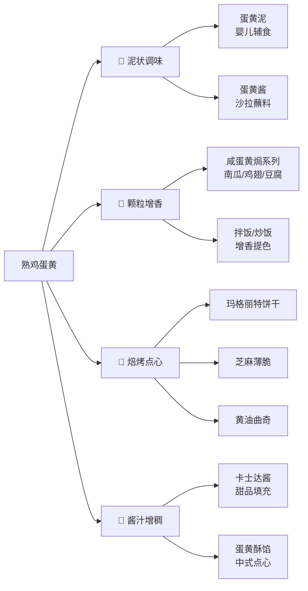

以下内容来自 z.ai 

煮熟的鸡蛋黄不仅能直接吃，还是厨房里的“全能配角”。由于它具有天然的油脂香气和粉质结构，非常适合用来**增香、勾芡、调沙拉酱**，甚至做成**中式点心或西式饼干**。

以下是为您整理的几种经典且实用的做法：

### 一、 经典中式菜肴（金沙系列）

熟蛋黄压碎后可以代替咸蛋黄，做出极具咸香口感的“金沙”料理：

* **金沙虾仁/玉米/南瓜：** 将熟蛋黄压碎，下油锅小火炒至冒细泡，倒入炸好的南瓜条或虾仁快速翻炒，让食材均匀裹上一层“金粉”。
* **蛋黄拌豆腐：** 将蛋黄压碎加少许香油、盐调成糊状，淋在嫩豆腐上，撒上葱花。
* **蛋黄炒饭：** 在炒饭最后撒入揉碎的熟蛋黄，能增加米饭的颗粒感和浓郁的蛋香味。

### 二、 自制酱料与冷菜

熟蛋黄是天然的增稠剂，能让酱汁口感更丝滑：

* **恶魔蛋 (Deviled Eggs)：** 将白水蛋切半取下蛋黄，混合美乃滋、黄芥末酱、黑胡椒后重新挤回蛋白凹槽中。
* **特调沙拉酱：** 将熟蛋黄压成泥，混入酸奶、橄榄油和柠檬汁，做成低卡的“蛋黄沙拉泥”，拌土豆或抹吐司都极佳。
* **日式蘸酱：** 把蛋黄过筛成粉末状，撒在拉面、乌冬面或蔬菜沙拉（如尼尼斯沙拉）上，不仅美观还能增加油脂香。

### 三、 烘焙与小零食（高手秘籍）

熟蛋黄在烘焙中有一个特殊作用：**破坏面筋，使成品更酥。**

* **玛格丽特饼干：** 这是最著名的消耗熟蛋黄的食谱。将熟蛋黄过筛混合低粉、玉米淀粉和黄油，做出的饼干具有“入口即化”的口感。
* **蛋黄派内馅：** 将熟蛋黄与牛奶、砂糖、少量黄油混合打碎成泥，可以作为自制面包或派的香甜内馅。
* **辅食磨牙棒：** 对于小朋友，可以将熟蛋黄混入面粉中烤制，营养丰富且质地松脆。

### 四、 快速消耗的小窍门

* **浓缩汤底：** 煮浓汤（如西红柿汤、南瓜汤）时，放一个碎蛋黄进去，汤头会立刻变得浓稠且颜色金黄诱人。
* **三明治抹酱：** 熟蛋黄混合牛油果泥，加少许海盐和辣椒粉，是绝佳的健身餐抹酱。

---

**建议：**
处理熟蛋黄时，建议先将其放入**细筛网**中，用勺子背按压，这样得到的蛋黄粉末最细腻，不会有颗粒感。

煮熟的鸡蛋黄（无论是水煮蛋、蒸蛋还是其他方式得到的）本身就是一种营养丰富的食材，**富含优质蛋白、卵磷脂、维生素和矿物质**【turn0search19】。很多人特别是小朋友可能会觉得直接吃蛋黄口感干噎，但如果巧妙运用，它能变化出各种美味，甚至变成餐桌上的“明星”。

下面我用一个流程图帮你快速了解熟蛋黄的主要做法方向，然后再展开详细说说：

---

### 🥣 一、泥状调味：细腻美味，百搭基底

将熟蛋黄碾成泥，是很多料理的基础，能有效改善口感，更易融合。

| 菜式/做法 | 核心思路 | 简单做法 | 适用场景/提示 |
| :--- | :--- | :--- | :--- |
| **蛋黄泥**【turn0search9】【turn0search19】 | 直接压碎，用少量液体调成泥状。 | 熟蛋黄用勺子压碎，加入**少许温开水、牛奶、米汤或菜水**【turn0search9】【turn0search19】调成均匀的泥状。 | **婴儿辅食**（从1/4个蛋黄开始添加【turn0search15】）、**面包抹酱**。 |
| **蛋黄酱**【turn0search0】【turn0search3】【turn0search22】 | 蛋黄泥作为乳化剂，与油、醋等混合搅拌。 | 熟蛋黄压碎后，加入**橄榄油、柠檬汁、盐、黑胡椒**【turn0search1】，或按需加入**糖粉、白醋**【turn0search3】【turn0search22】，用打蛋器或搅拌机持续搅拌至浓稠乳化。 | **沙拉调味**、**三明治酱**、**蘸食薯条/蔬菜**。自制无添加更健康【turn0search17】。 |
| **卡士达酱**【turn0search3】【turn0search22】 | 蛋黄泥与牛奶、糖、淀粉混合煮制，形成浓稠酱料。 | 蛋黄与部分牛奶、糖、低筋面粉/玉米淀粉拌匀【turn0search3】【turn0search22】，剩余牛奶与奶油煮开，冲入蛋黄糊，搅拌后倒回锅中煮至浓稠。 | **泡芙填充**、**蛋糕夹心**、**水果淋酱**。 |

> 💡 **小贴士**：压碎蛋黄时，使用**滤网**【turn0search3】【turn0search16】或**研磨钵**【turn0search24】能得到更细腻的泥状，口感更好。

---

### 🧂 二、颗粒增香：经典风味，风味炸弹

将熟蛋黄搓成颗粒或碎末，是提升菜肴香气和口感的“魔法”，咸甜皆宜。

| 菜式/做法 | 核心思路 | 简单做法 | 适用场景/提示 |
| :--- | :--- | :--- | :--- |
| **咸蛋黄焗系列** | 咸蛋黄**炒出香味**，裹满食材，沙沙的口感和咸鲜味是核心。 | 1.  **食材准备**：南瓜切条【turn0search11】、鸡翅腌制裹粉【turn0search11】【turn0search12】、豆腐切块【turn0search14】、玉米段、茄子等。 2.  **处理蛋黄**：熟咸蛋黄（或用普通熟蛋黄加少量盐）**压碎**。 3.  **炒香焗煮**：锅中少许油，小火炒香蛋黄碎至起泡，加入处理好的食材翻炒，使食材均匀裹上蛋黄酱汁，最后可稍加调味或加水焖煮片刻（如豆腐）。 | **南瓜**【turn0search11】【turn0search13】、**鸡翅**【turn0search11】【turn0search12】、**豆腐**【turn0search13】【turn0search14】、**茄子**、**玉米**、**四季豆**【turn0search12】、**大虾**【turn0search12】、**排骨**【turn0search12】。**咸蛋黄脑袋的最爱**。 |
| **拌饭/炒饭** | 蛋黄颗粒增加米饭的**香气、粘糯感和层次**。 | 1.  **拌饭**：热米饭中加入压碎的熟蛋黄、少许酱油、海苔碎、芝麻，拌匀即食。 2.  **炒饭**：炒饭最后阶段，加入压碎的熟蛋黄、盐、葱花，快速翻炒均匀，让米饭粒粒金黄。 | **懒人快手餐**、**处理剩饭**、**小朋友喜欢的“黄金炒饭”**。 |

> ⚠️ **注意**：普通熟蛋黄**没有咸蛋黄的沙沙口感和独特咸香**，但可以撒少许盐、糖或鸡精提味。追求正宗口感需使用咸蛋黄。

---

### 🥐 三、焙烤点心：酥香可口，甜点担当

熟蛋黄是许多经典中式和西式点心的关键成分，能带来浓郁的蛋香和酥松的口感。

| 菜式/做法 | 核心思路 | 简单做法（关键点） | 适用场景/提示 |
| :--- | :--- | :--- | :--- |
| **玛格丽特饼干**【turn0search3】【turn0search22】 | 熟蛋黄与黄油、面粉等混合，冷藏后搓球，烤制后表面自然开裂，口感酥松。 | 黄油软化加糖粉打发，加入**过筛的熟蛋黄**拌匀，筛入低粉和玉米淀粉揉成面团，冷藏，取小块搓球，压扁，烤箱170℃烤15-20分钟。 | **入门级曲奇**、**颜值高口感好**、**适合作为小零食**。 |
| **熟蛋黄芝麻薄脆**【turn0search3】【turn0search22】 | 蛋黄、油、糖与面粉混合，擀薄烤制，加入芝麻增香，口感酥脆。 | 所有材料混合成团，擀成薄片，刷蛋液撒芝麻，切小块，烤箱中层烤至金黄。 | **下午茶小点**、**磨牙棒**、**可以自己控制糖量**。 |
| **熟蛋黄黄油曲奇**【turn0search3】【turn0search22】 | 黄油、蛋黄、面粉等混合，通过裱花嘴挤花，口感香酥浓郁。 | 黄油加糖粉打发，加入过筛蛋黄拌匀，筛入低筋面粉和盐，用裱花嘴挤成花形，烤箱烤制。 | **经典曲奇**、**口感酥松**、**可作为礼物**。 |

> 🌟 **进阶提示**：这些饼干曲奇的酥松口感很大程度上来源于**熟蛋黄**，它比生蛋黄更能促进黄油与面粉的乳化，口感更佳。

---

### 🍲 四、酱汁增稠：浓郁顺滑，美味升级

熟蛋黄可以作为天然增稠剂和乳化剂，让酱汁口感更浓郁丝滑。

| 菜式/做法 | 核心思路 | 简单做法 | 适用场景/提示 |
| :--- | :--- | :--- | :--- |
| **中式蛋黄酱** | 咸蛋黄压碎后与少量油炒制，用于拌菜或蘸食。 | 咸蛋黄压碎，锅中加少许油，小火炒香至融化起泡，可加入海苔碎、芝麻、葱花、盐、黑胡椒粉调味。【turn0search18】 | **凉拌木耳**、**拌面**、**蘸食白灼蔬菜**。**咸香开胃**。 |
| **西式蛋黄酱/美乃滋** | **生蛋黄**或**熟蛋黄**（风味不同）作为乳化剂，与植物油、醋或柠檬汁混合乳化。 | 熟蛋黄压碎，**少量多次**加入植物油（如橄榄油）并不断搅拌至乳化变浓稠，最后加入醋、盐、胡椒粉调味。【turn0search0】【turn0search3】 | **沙拉酱**、**汉堡酱**、**三明治酱**。**熟蛋黄版风味更独特**。 |
| **卡士达酱** | （已在上文提及）蛋黄、糖、淀粉与牛奶混合煮制而成。 | （见上文） | **泡芙填充**、**蛋糕夹心**、**水果酱**。**甜品必备**。 |

---

### 🍳 五、其他创意做法

除了以上分类，熟蛋黄还能这样用：

*   **蛋黄粥**【turn0search24】：白粥煮好后，加入压碎的熟蛋黄和少许松花蛋碎、盐，再煮5分钟，浓稠香美。
*   **熟蛋黄鸡蛋盅**【turn0search3】【turn0search22】：水煮蛋对半切开，取出蛋黄压碎，与焯过水的胡萝卜丁、洋葱丁、牛奶、盐、胡椒拌匀，填回蛋白中，装饰即可。
*   **萌鸡饭团**【turn0search3】【turn0search22】：熟蛋黄过筛后与沙拉酱拌匀，和熟米饭混合揉成团，用胡萝卜花、海苔做装饰，可爱又营养。
*   **凉拌熟蛋黄**【turn0search24】：熟蛋黄压碎，与海蜇丝、黄瓜丝等拌在一起，加入蒜末、香油、醋、生抽等调味，清爽下酒。

---

### ⚖️ 重要提示：关于熟蛋黄的食用

1.  **胆固醇问题**：蛋黄胆固醇含量较高。健康成年人每天食用**1-2个鸡蛋**（包括蛋黄）是合理的【turn0search2】。**血脂异常或胆固醇偏高者**应咨询医生或营养师，控制蛋黄摄入量。
2.  **卫生与新鲜**：确保鸡蛋**新鲜**，煮透（蛋白凝固，蛋黄中心温度达到70℃以上）【turn0search8】。**不要吃生或半熟的鸡蛋**，以避免沙门氏菌感染。
3.  **口感处理**：如果觉得直接吃蛋黄干噎，可以试试上述的泥状、颗粒化做法，搭配粥、面包、沙拉等一起吃，口感会好很多。
4.  **储存**：处理好的熟蛋黄制品（如酱料、泥）应**尽快食用**，冷藏保存也不宜过久（建议1-2天内）。

---

### 💎 总结与建议

熟鸡蛋黄真的是个“宝藏食材”，简单处理就能变身多种美味：

*   **想追求细腻口感**：试试做**蛋黄泥**、**蛋黄酱**或**卡士达酱**。
*   **想制造惊喜风味**：用咸蛋黄（或加盐调味的熟蛋黄）做**焗菜**、**拌饭炒饭**。
*   **想烘焙香气点心**：**玛格丽特饼干**、**芝麻薄脆**是很好的选择，酥松又好吃。
*   **想丰富餐桌**：**蛋黄粥**、**鸡蛋盅**、**凉拌菜**都能带来不一样的体验。

> 🍳 **最后，如果你手边正好有煮熟的鸡蛋，不妨就试试最简单的“蛋黄酱拌沙拉”或“黄金炒饭”吧，简单又美味！**

希望这些想法能给你带来灵感，让你再也不用担心煮剩下的蛋黄该怎么办了。如果你有特别想尝试的做法，或者对某种风味有偏好，我可以给你更具体的指导。

以下内容来自 gemini.google.com 

既然这些蛋黄已经冷冻，那它们现在的状态最适合做成**“半成品酱”**或**“馅料”**。冷冻后的熟蛋黄口感会变干、变硬，直接吃并不美味，但经过高温油炸或粉碎处理后，香气会重新激发。

针对这 3-5 公斤的存量，我为您梳理了一个**“阶梯式消耗计划”**：

### 第一步：基础处理（脱腥与回软）

冷冻过的蛋黄往往有股“冰箱味”或蛋腥味。

1. **解冻：** 先在冷藏室自然解冻。
2. **去味：** 在蛋黄上喷洒少量**高度白酒**（如红星二锅头），入蒸锅大火蒸 5-8 分钟，或者入烤箱 150°C 烤 5 分钟。
3. **粉碎：** 趁热用勺子压碎，或者直接丢进料理机打成**细粉末**。

---

### 第二步：核心消耗方案（按消耗量排序）

#### 方案 A：万能“金沙流沙酱”（消耗 1-2 公斤）

这是消耗最快的方法。做成酱后，容积会缩小，且油封可以保护蛋黄不被氧化。

* **配比：** 碎蛋黄 500g、黄油/植物油 300g、糖 50g、奶粉 50g（可选，增加奶香味）。
* **做法：** 锅中倒油，小火将碎蛋黄炒至起浓密的白色泡沫，加入糖和奶粉拌匀即可。
* **怎么吃：** 拌面、抹吐司、做流沙包内馅。

#### 方案 B：蛋黄肉松混合馅（消耗 1 公斤）

如果你喜欢中式点心，这是消耗大户。

* **做法：** 蛋黄碎混入大量肉松，加入适量沙拉酱调和。
* **怎么吃：** 揉成小球做成**青团馅、蛋黄酥馅**，或者直接夹在**手抓饼、三明治**里。这个馅料可以继续放回冷冻，随取随用。

#### 方案 C：蛋黄粉末“调味料”（消耗 0.5 公斤）

* **做法：** 将蛋黄彻底烘干（烤箱低温慢烤），打成极细的粉，装瓶。
* **怎么吃：** 把它当成**“中式芝士粉”**。撒在炸鸡上、薯条上，或者煮大米粥时放一勺。

---

### 💡 特别提醒：关于“3-5公斤”的健康建议

由于蛋黄的胆固醇和脂肪含量较高，这么大的量不建议短期内高频食用。

* **分送：** 如果做成了“金沙酱”或“玛格丽特饼干”，非常适合装在精美的小罐里送给亲友，他们甚至会觉得这是你特意购买的高级食材。
* **宠物补给：** 如果你有养狗或猫，熟蛋黄是极好的美毛食物。你可以分出 0.5 公斤，每天给它们拌一点在粮里（注意不要加盐、油等调料）。

---