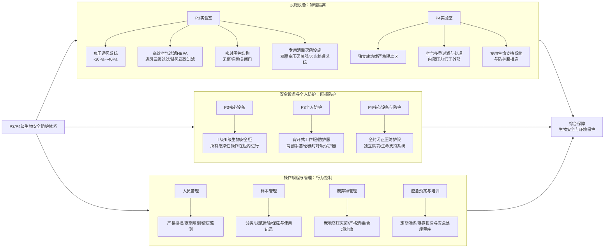
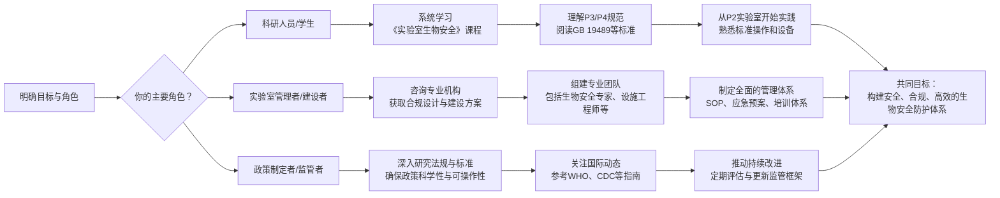

以下内容来自z.ai

理解你希望深入了解P3/P4级生物安全防护的需求。这确实是一个专业且要求极高的领域，通常与**处理高危病原体**（如结核杆菌、炭疽芽孢、SARS-CoV-2病毒株、埃博拉病毒等）【turn0search0】【turn0search4】【turn0search6】的科研、疾病防控和公共卫生工作紧密相关。

我会为你系统梳理达到P3/P4级生物安全防护的核心要素、关键措施和实施路径。

### 🧪 一、理解生物安全等级（BSL）与P3/P4实验室

首先，你需要了解生物安全等级的划分。国际上普遍将生物安全实验室分为四级（BSL-1至BSL-4），对应的防护水平从低到高。我国通常用P1-P4表示，P即Protection（防护）【turn0search4】【turn0search6】。

| 生物安全等级 (BSL/P) | 风险等级定义                                                                                              | 典型病原举例                                   | 主要防护特点                                                                                                                               |
| :------------------- | :------------------------------------------------------------------------------------------------------ | :--------------------------------------------- | :--------------------------------------------------------------------------------------------------------------------------------------- |
| **BSL-1 / P1**       | 不会致病的微生物，对健康工作者和环境无危害【turn0search10】                                                            | 大肠杆菌K-12、枯草芽孢杆菌                             | 基础实验室，无需特殊通风，标准微生物操作规范                                                                                                       |
| **BSL-2 / P2**       | 能引起疾病，但对健康成人、群体和环境不构成严重威胁，有有效预防和治疗措施【turn0search4】【turn0search10】                                          | 流感病毒、沙门氏菌、乙肝病毒（血清学检测除外）                 | **一级屏障**（生物安全柜）、**二级屏障**（定向气流、洗手设施）【turn0search4】                                                                                   |
| **BSL-3 / P3**       | **主要通过呼吸途径传播**，能使人感染**严重甚至致死疾病**的致病微生物，通常有预防和治疗措施【turn0search0】【turn0search2】【turn0search4】 | 结核分枝杆菌、炭疽芽孢杆菌、SARS-CoV-2病毒株、鼠疫杆菌 | **严格的一级屏障**（Ⅱ级以上生物安全柜、呼吸保护器）、**严格的二级屏障**（**负压实验室**、高效空气过滤、更衣/缓冲间）【turn0search0】【turn0search2】【turn0search3】 |
| **BSL-4 / P4**       | 对人体具有**高度危险性**，通过**气溶胶途径传播或传播途径不明**，**尚无有效疫苗或治疗方法**的致病微生物【turn0search2】【turn0search4】         | 埃博拉病毒、马尔堡病毒、拉沙病毒                           | **最高等级的一级屏障**（**全封闭正压防护服**、生命支持系统）、**最高等级的二级屏障**（**独立建筑物**或**严格隔离区域**、**多重空气过滤**、**专用水电消毒处理系统**）【turn0search4】【turn0search6】 |

**核心区别**：从P3到P4，核心区别在于**病原体的致死率、传播能力和治疗手段的有无**，以及由此决定的**物理隔离的严格程度**（从“实验室自成一区”到“独立建筑”）和**个人防护的等级**（从“呼吸保护器”到“全封闭生命支持防护服”）【turn0search2】【turn0search4】。

---

### 🏢 二、达到P3/P4级防护的三大核心支柱

实现P3/P4级别的防护是一个系统工程，它依赖于**标准化的设施设备（硬件）、严格的操作规程（软件）和全面的管理体系（保障）** 三者的紧密结合，缺一不可。

#### 🏗️ 1. 设施设备要求（二级屏障）

这是保障实验室与外部环境隔离的**物理基础**，是“二级屏障”。

| 要求维度 | P3级实验室关键要求【turn0search2】【turn0search3】【turn0search11】 | P4级实验室关键要求【turn0search4】 |
| :--- | :--- | :--- |
| **选址与布局** | 自成一区，通过隔离门与公共区域相隔；设**核心实验间、缓冲间**（两道连锁门）；更衣/淋浴区【turn0search2】【turn0search11】。 | **独立建筑物**或位于建筑物内的**严格隔离区域**，与外部和周围建筑物完全隔离；通常设**防护服更换间、化学淋浴间、核心工作间、双扉高压灭菌器间**等【turn0search4】。 |
| **围护结构** | 密封、光滑、耐腐蚀、防水；**无窗（除密封观察窗外）**；门自动关闭；墙角圆弧形密封【turn0search2】【turn0search3】。 | 更高等级的**气密性、耐腐蚀性**，所有缝隙严格密封，确保绝对隔离【turn0search4】。 |
| **通风空调系统** | **独立送排风系统**，**负压**（核心间-30~-40Pa，缓冲间-15~-20Pa）；**定向气流**（清洁→污染）；**高效空气过滤器（HEPA）** 处理进风（初/中/高效三级）和排风；排风直排高空或经处理排入建筑排风系统，**不得回风**【turn0search2】【turn0search3】【turn0search11】。 | **更严格的负压梯度控制**；排风需经**多重HEPA过滤**或加其他方法（如焚烧）处理后，以**不低于12m/s的速度**向高空排放；**空气需经多次高效过滤和净化**；可能配备**专用生命支持系统**连接至防护服【turn0search3】【turn0search4】。 |
| **水电与消毒** | 可靠的**双路供电**及应急电源（保障生物安全柜、风机、照明等至少30分钟）；**专用下水道**与城市污水系统隔离，经**专用的消毒灭菌系统**（如加氯、高温）处理后方可排放；**双扉高压灭菌器**（主体在防护区内）传递窗**双门互锁**【turn0search3】【turn0search11】。 | **极高可靠性的专用水电保障系统**；**所有液体和气体废弃物**都必须经过**严格的、可验证的灭活处理**（如高压灭菌、化学消毒、焚烧）才能移出实验室；配备**化学淋浴装置**对防护服进行消毒【turn0search4】。 |

#### 🛡️ 2. 安全设备与个人防护装备（一级屏障）

这是在操作层面**直接保护人员**和**防止病原体外逸**的“一级屏障”。

| 防护层级 | P3级实验室要求【turn0search0】【turn0search2】【turn0search13】 | P4级实验室要求【turn0search1】【turn0search4】 |
| :--- | :--- | :--- |
| **核心安全设备** | **Ⅱ级或Ⅲ级生物安全柜**：所有涉及感染性材料的操作必须在内进行。**不得在安全柜外进行**，除非有综合防护措施【turn0search0】【turn0search2】。 | **Ⅲ级生物安全柜**（手套箱式）：它是核心操作设备，提供最高的物理隔离。 |
| **个人防护装备(PPE)** | **进入前**：在专用更衣室穿**背开式工作服**或其他防护服【turn0search0】【turn0search2】。**操作时**：必须戴**两副手套**（一次性手套先消毒后丢弃）；进行感染性组织培养或可能产生气溶胶的操作时，使用**个体防护设备**；必要时使用**呼吸保护装置**（如N95口罩或更高级别）【turn0search0】【turn0search2】。 | **全封闭、正压的防护服**（类似宇航服）：自带**生命支持系统**，提供呼吸用空气，并在内部维持正压，防止外部污染空气进入。**所有进入和离开**都需经过**严格的淋浴和化学消毒程序**【turn0search1】【turn0search4】。 |
| **其他设备** | **可能产生气溶胶的设备**（如离心机）应置于**物理抑制装置**中，排风需经HEPA过滤【turn0search2】。 | 所有设备都必须与防护服的**生命支持系统**兼容，并经过严格的**气密性测试**和**消毒验证**。 |

#### 📋 3. 操作规程与管理体系（软件保障）

再好的设施和设备，也需要**严格规范的操作流程**和**全面的管理体系**来发挥其防护作用。

| 管理维度 | 核心要求与措施 |
| :--- | :--- |
| **人员管理** | **严格授权**：只有经过**专门培训**、**充分了解风险**且**考核合格**的人员才能进入【turn0search1】【turn0search18】。**持续培训**：定期进行**操作技能、生物安全、应急处理**等方面的培训和演练【turn0search18】。**健康监测**：建立工作人员**健康档案**，必要时进行**疫苗接种**和**血清学监测**；限制易感人员（如免疫缺陷者）进入【turn0search12】【turn0search18】。 |
| **样本与菌毒种管理** | **分类管理**：严格按照国家《病原微生物实验室生物安全管理条例》对病原微生物进行分类（第一、二类为高致病性）【turn0search5】。**规范运输**：高致病性病原微生物菌（毒）种或样本的运输需经**省级以上卫生或兽医主管部门批准**，并使用**三层包装**，由**不少于2人的专人护送**，严禁通过公共交通工具运输【turn0search5】。**保藏与使用**：设立**专用保藏库/柜**，建立**详细的领取、使用、销毁记录**，实行**双人双锁管理**【turn0search16】。 |
| **实验操作规范** | **标准微生物操作规范**：严禁在实验室内饮食、吸烟、化妆、处理隐形眼镜；**用嘴吸液**是绝对禁止的【turn0search18】。**锐器安全**：制定锐器安全使用规范，尽量使用塑料制品替代玻璃，**禁止用手直接套回针帽**【turn0search12】。**气溶胶预防**：所有操作应**小心、细致**，尽量避免产生气溶胶；**离心**时使用**密封转子或安全杯**【turn0search12】【turn0search13】。**废弃物处理**：所有实验废弃物（包括培养物、手套、口罩等）必须**就地经高压灭菌或其他有效方法消毒**后，才能作为普通垃圾处理或移出实验室【turn0search18】。 |
| **应急与暴露处理** | **制定应急预案**：包括**人员暴露、意外事故、设备故障、火灾**等各种可能情况的应急处理程序【turn0search12】。**立即报告**：任何**暴露事件、飞溅、破损**等都必须**立即向实验室负责人和生物安全办公室报告**【turn0search12】。**医学处理**：提供**暴露后预防**（如用药、疫苗）、**医疗评估**和**必要的医学隔离**【turn0search12】。 |
| **文件与记录** | **程序文件（SOP）**：编写详细的、针对本实验室的标准操作程序（SOP），并**定期评审更新**【turn0search12】。**完整记录**：所有实验活动、培训、设备维护、消毒灭菌、废弃物处理、暴露事件等都必须有**完整、准确的记录**，便于追溯和审查。 |

---

### ⚠️ 三、建设与运营P3/P4实验室的注意事项

1.  **合规性是首要前提**：P3/P4实验室的建设、管理和实验活动必须严格遵守**《中华人民共和国生物安全法》、《病原微生物实验室生物安全管理条例》** 等法律法规，以及**《实验室生物安全通用要求》（GB 19489-2008）、《生物安全实验室建筑技术规范》（GB 50346-2011）** 等国家标准【turn0search5】【turn0search11】。**任何实验活动都必须经过相应的审批和备案**。

2.  **投入巨大，专业要求高**：P3/P4实验室的**建设成本、维护成本和运行成本都非常高昂**。其设计、建造、验收、认证都需要由**具备相应资质的专业机构**完成，绝非普通实验室的简单升级。

3.  **依赖持续的维护和验证**：并非建好就万事大吉。**负压梯度、HEPA过滤器效率、生物安全柜性能、气流组织、防护服气密性等**都需要**定期进行严格的检测、验证和维护**，确保其始终处于有效的防护状态【turn0search11】【turn0search15】。

4.  **“软件”比“硬件”更重要**：再先进的设施，如果**操作人员没有接受严格培训、安全意识淡薄、不遵守操作规程，那么防护体系形同虚设**。**人是生物安全中最关键、最易变的因素**，管理和培训永远在路上。

5.  **我国高等级生物安全实验室网络正在完善**：根据国家卫健委2022年8月的数据，全国已有从事人间传染病原微生物实验室活动的**P3、P4实验室63个，P2实验室4.6万个**【turn0search8】【turn0search9】。国家计划实现**每个省至少有一个P3实验室，每个地级市至少有一个P2实验室**【turn0search9】。这表明国家层面正在持续加强高等级生物安全实验室体系建设。

---

### 🔍 四、如何开始：给你的行动建议

如果你的目标是**了解**或**参与**相关工作，可以按以下路径进行：

1.  **深入学习理论知识**：系统阅读**《实验室生物安全通用要求》（GB 19489）、《生物安全实验室建筑技术规范》（GB 50346）、WHO的《实验室生物安全手册》** 等核心文件和标准。这些是所有工作的基石。

2.  **参加专业培训**：寻找由**国家级或省级疾控中心、权威科研院所、行业协会**举办的**生物安全实验室建设、管理、操作技术培训班**。获得证书是专业能力的证明。

3.  **实地参观与交流（如有可能）**：如果条件允许，可以**申请参观已通过认证的P3实验室**（注意遵守严格的参观流程和安全规定），直观了解其布局、设备和流程。与一线操作人员和管理者交流，获取宝贵经验。

4.  **从P2实验室打基础**：绝大多数与生物安全相关的工作都始于P2实验室。**熟练掌握P2级别的所有操作规程、设备使用（特别是生物安全柜）、消毒灭菌技术和废弃物处理流程**，这是迈向更高等级的必经之路。

5.  **寻求专业咨询**：如果涉及实验室的规划、设计或认证，**务必咨询具有丰富经验和资质的专业机构或专家**，确保从一开始就走在正确的道路上，避免走弯路和不符合要求。

> 💡 **核心提示**：P3/P4级生物安全防护是一个**高度专业化、法规驱动、投入巨大且容错率极低**的领域。它本质上是**通过工程控制和管理措施，将人类活动与高危病原体进行彻底隔离**，其成功依赖于**每一个细节、每一次操作和每一个人都严格遵循既定的规范和流程**。

希望以上信息能为你提供一个全面而清晰的框架。如果你对某个具体细节，比如HEPA过滤器的维护、生物安全柜的年检规程，或者某个特定病原体的操作规程有更深入的疑问，我很乐意在合规的范围内继续与你探讨。